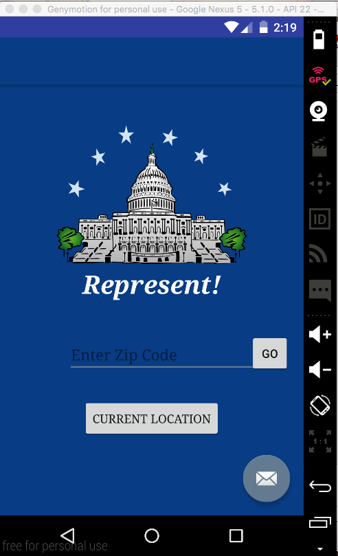
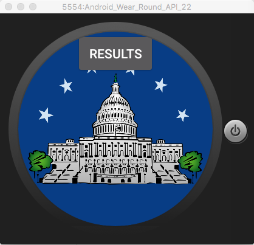
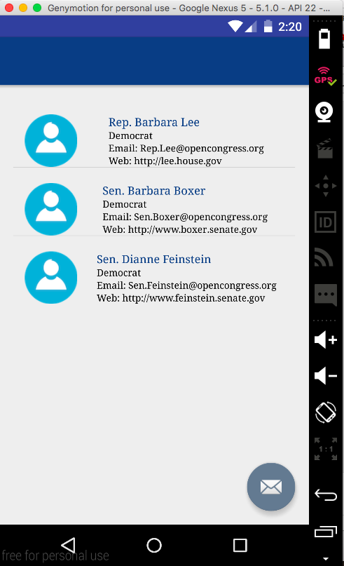
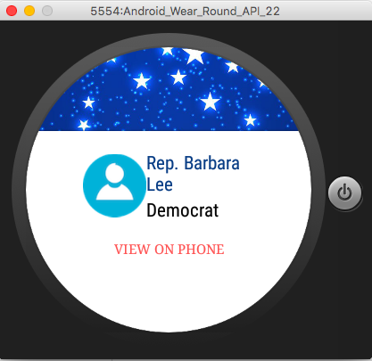
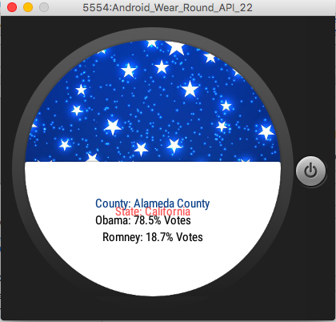

# PROG 02: Represent!

Represent! is inspired by the upcoming election in 2016. Users can get to know who senators and representatives are in a specific area they want to know.By typing zip code or touch on Current Location, users can easily access information on the phone and watch at the same time. Information on the watch is always updated every time users update zip code or current location on the phone. On the watch, only title and party are display. In order to get a representative's detail information, users can simply touch on the screen of that person. A detail view will be displayed on the phone right away. Besides, users can get 2012 election information by swiping on the Representative. 
## Authors

Nhi Tran ([nhitran2610@berkeley.edu](mailto:nhitran2610@berkeley.edu))

## Demo Video

See [Represent!] (https://youtu.be/CilDxVzfuM4)

## Screenshots

## Acknowledgments

* Hat tip to anyone who's code was used
* Any other support
